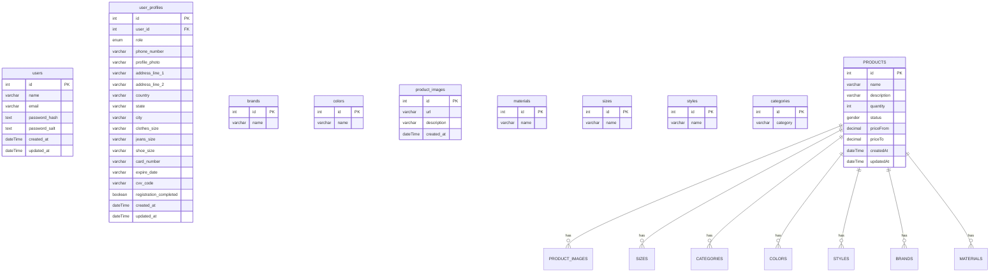

### 1. Backend

#### 1.1 Technologies

- [Nest.js](https://nestjs.com/) - a backend framework.
- [TypeOrm](https://typeorm.io/) - an ORM.

#### 1.2 Folder Structure

1. common - holds shared components, constants, decorators, exceptions, guards, interfaces, middlewares, pipes, serializers, and validations.
2. migrations - holds migration files.
3. modules - holds modules, services, repositories, dto etc.

## 2. How to Run

### 2.1 Manually

_To work properly, fill in the **`.env`** file. Use the **`.env.example`** file as an example._

1. Install dependencies: **`npm install`**.
2. Create docker image: **`docker compose up`**
3. Run all migrations: **`npm run migration:run`**
4. Run all seeds: **`npm run seed`**
5. Start the server: **`npm run start`**

### 3. Branch Flow

Use `npm run format` and `npm run lint`. It automatically corrects a certain number of errors.

```
<type>-<short-desc>
```

Examples:

- `feature-add-dashboard`
- `feature-add-user-flow`
- `fix-user-flow`

### 4. DB schema

